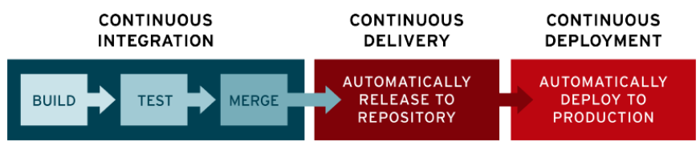

# `CI / CD / 파이프라인 이란?`

## CI/CD
### CI (Continuous Integration)
CI/CD 의 "CI" 는 개발자를 위한 자동화 프로세스인 `지속적인 통합`(Continuous Integration)을 의미한다.

CI 를 성공적으로 구현할 경우 애플리케이션에 대한 새로운 `코드 변경 사항이 정기적으로 빌드 및 테스트외어` 공유 리포지토리에 통합되므로,
여러 명의 개발자가 동시에 애플리케이션 개발과 관련되 코드 작업을 할 경우 `서로 충돌할 수 있는 문제를 해결`할 수 있다.

 

---
### CD(Continuous Delivery / Deployment)
CI/CD의 "CD"는 `지속적인 서비스 제공`(Continuous Delivery) 및/또는 `지속적인 배포`(Continuous Deployment)를 의미하며 이 두 용어는 상호 교환적으로 사용된다.

두 가지 의미 모두 파이프라인의 추가 단계에 대한 자동화를 뜻하지만 때로는 얼마나 많은 자동화가 이루어지고 있는지를 설명하기 위해 별도로 사용되기도 한다.

 

#### 지속적인 제공(Continuous Delivery)
이란 개발자들이 애플리케이션에 `적용한 변경 사항`이 **버그 테스트를 거쳐 리포지토리(예: GitHub 또는 컨테이너 레지스트리)에 자동으로 업로드**되는 것을 뜻하며, 운영팀은 이 리포지토리에서 애플리케이션을 실시간 프로덕션 환경으로 배포할 수 있다.

이는 개발팀과 비즈니스팀 간의 가시성과 커뮤니케이션 부족 문제를 해결해 준다.

지속적인 제공은 `귀찮은 push 작업없이` 최소한의 노력으로 `새로운 코드를 배포`하는 것을 목표로 한다.

 

#### 지속적인 배포(Continuous Deployment)
란 개발자의 변경 사항을 리포지토리에서 고객이 사용 가능한 프로덕션 환경까지 자동으로 릴리스하는 것을 의미한다.

이는 애플리케이션 제공 속도를 저해하는 수동 프로세스로 인한 운영팀의 프로세스 과부하 문제를 해결한다.

지속적인 배포는 파이프라인의 다음 단계를 자동화함으로써 지속적인 제공이 가진 장점을 활용한다.

CI / CD 장점
CI / CD를 실천하면 개발, 테스트, 운영 모범 사례에 팀을 맞춤으로써

다음과 같은 실질적 혜택도 얻을 수 있다.

변경 사항을 자주 푸시하고자 하는 개발자와 안정적인 애플리케이션을 원하는 운영 담당자 사이의 마찰을 해결한다.
코드 변경을 사용자에게 푸시하기 전에 검증하기 위해 개발 팀은 지속적인 테스트를 실행해야 한다.
큰 변경보다 안정적으로 통합 및 테스트가 가능한 더 작은 규모의 증분적 코드 변경을 수행하도록 개발자를 독려한다.
새로운 기능을 위한 더 넓은 범위의 개발 작업을 수행하는 동시에 신속한 수정 요청까지 받는 팀에 작업의 유연성을 부여한다.
기능, 성능 및 데이터 중심 테스트를 더 많이 실행해서 더 높은 품질의 애플리케이션을 제공하고 프로덕션 결함을 줄일 수 있게 해준다.