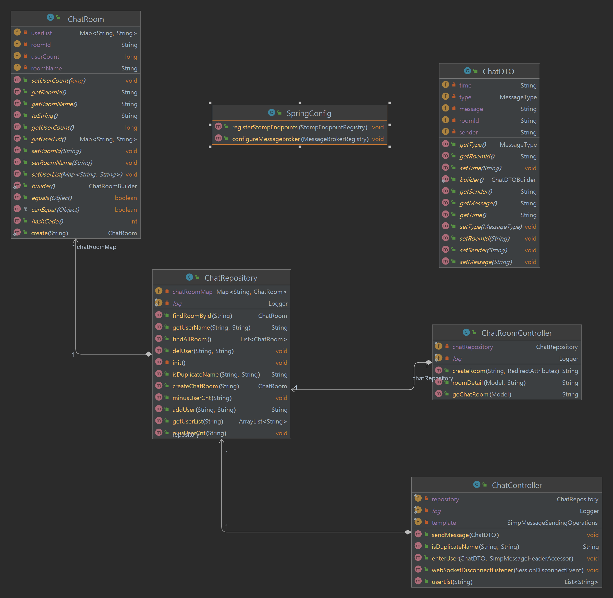
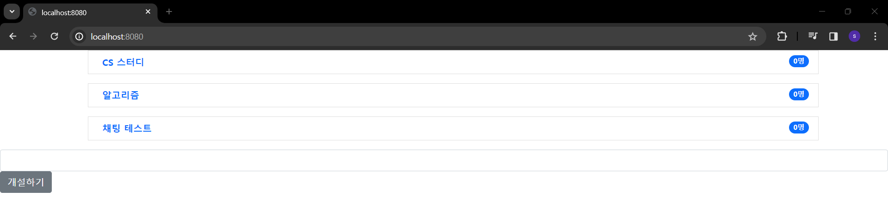
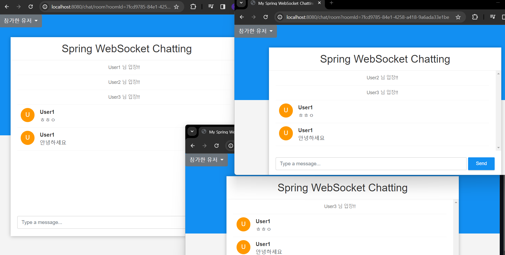

# SpringBoot WebSocket Chatting Project
## 0. Spring Boot 와 WebSocket 을 활용한 채팅 만들기 프로젝트
- DB 연결 없이 메모리를 이용한 채팅 프로그램 개발

## 1. 사용 기술
- Java 8
- Spring Boot MVC
- Gradle
- AJAX
- jquery
- WebSocket & SocketJS
- Stomp
- 추후 DB 기술 추가 예정

## 2. 다이어그램

## 3. 목표
- WebSocket 을 활용한 채팅 기능
- Stomp 를 활용한 채팅 고도화 -> pub/sub
- SocketJS 활용

## 4. 구현 기능
- 채팅방 생성
- 채팅방 생성 시 중복검사
- 채팅방 닉네임 선택
  => 닉네임 중복 시 임의의 숫자를 더해서 중복 안되도록
- 채팅방 입장 & 퇴장 확인
- 채팅 기능
- 채팅방 유저 리스트 & 유저 숫자 확인

## 5. 추후 추가 기능(목표 기능)
- 채팅방 삭제
- 채팅방 파일 업로드
- 유저 클릭 시 1:1 채팅으로 전환
- 로그인 유저 채팅 && 소셜 로그인유저 채팅

## 6. 구동방법
- 프로젝트를 jar 파일로 빌드
- cmd 에서 java -jar "파일명" 타이핑
- localhost:8080 으로 접속!

## 구동 화면

